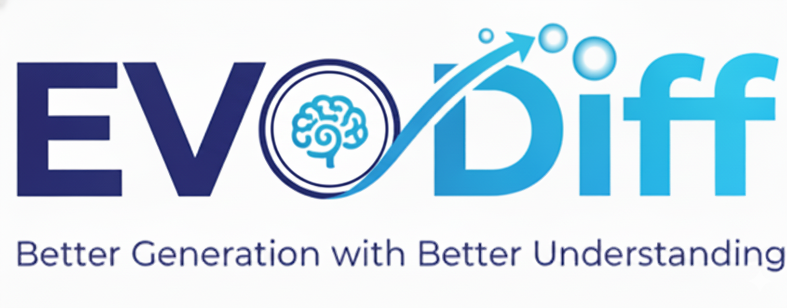
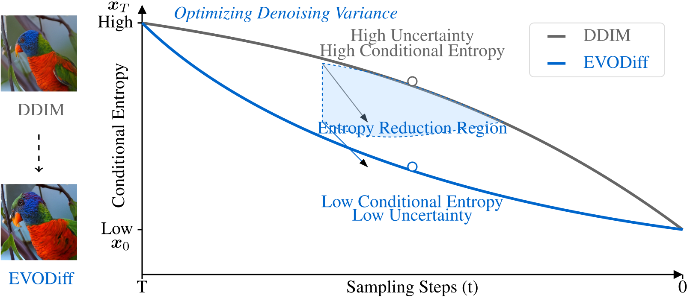
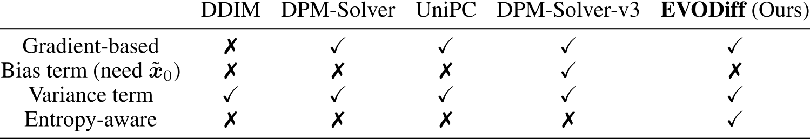
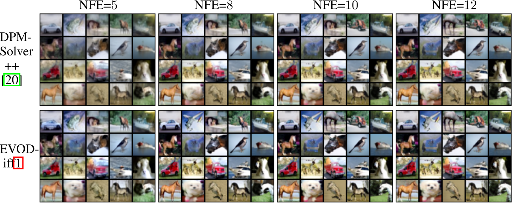

<div align="center">
  <a href="https://openreview.net/forum?id=rKASv92Myl">
      
  </a>
   
  <h1>✨ EVODiff: Entropy-aware Variance Optimized Diffusion Inference</h1>
   
  <a href="https://neurips.cc/virtual/2025/loc/san-diego/poster/115792"> 
    
  </a>

  <h2>
    <a href="https://openreview.net/forum?id=rKASv92Myl">
      <strong>NeurIPS 2025 </strong> 
    </a> 🔥🔥🔥🔥
  </h2>

  <p><em>A novel entropy-aware inference framework that enhances the denoising generation capabilities of diffusion models</em></p>

  <p>If you find this work useful, please give us a star 🌟.</p>
  
  <p>
    <a href="https://openreview.net/pdf?id=rKASv92Myl">Paper</a> • 
    <a href="https://openreview.net/forum?id=rKASv92Myl">OpenReview</a> • 
    <a href="https://arxiv.org/abs/2509.26096">arXiv</a> • 
    <a href="#-quick-start">Quick Start</a> • 
    <a href="#-citation">Citation</a>
  </p>

  <p>
    <a href="https://scholar.google.com/citations?user=Fm039ikAAAAJ&hl=en">Shigui Li</a><sup>1</sup>,
    <a href="https://scholar.google.com/citations?user=r5fgeWQAAAAJ&hl=en&oi=sra">Wei Chen</a><sup>1</sup>,
    <a href="https://scholar.google.com/citations?user=08RCdoIAAAAJ&hl=en">Delu Zeng</a><sup>2✉️</sup>
  </p>

 
  
  <p>
    
    <sup>1</sup>
    
    <sup>2</sup>
    
  </p>

 


</div>


---

## 🔭 Overview

**EVODiff** is an efficient diffusion model inference framework grounded in entropy-aware information flow optimization. It systematically improves image quality and accelerates generation by optimizing conditional variance at each step, all without relying on reference trajectories.

We reveal that successful denoising generation of diffusion models fundamentally operates by reducing conditional entropy during reverse transitions, grounded in information-theoretic principles.

<div align="center">
  
  <!-- <p><em>Illustration of conditional entropy reduction during diffusion model inference. EVODiff achieves lower conditional entropy in reverse transitions compared to traditional methods.</em></p> -->
</div>

## 💡 Key Features

EVODiff stands out by being the first entropy-aware diffusion model inference framework for better generation by optimizing the denoising information flow of diffusion models.  
* 🛡️ **Significant Theoretical Contribution**: Provides the **first rigorous mathematical proof** that data-prediction parameterization is superior to noise-prediction for diffusion model inference, theoretically grounding previous empirical findings. 🔥 
* 📉 **Entropy-aware Denoising**:  Directly optimizes reconstruction error by systematically leveraging entropy-aware information flow and variance reduction.
* 🚀 **Reference-free via On-the-fly Optimization**: Achieves superior performance without relying on reference trajectories or costly optimization procedures (unlike methods that require optimization or distillation from $\tilde{x}_0$).

<div align="center">
    
    <p><em>Comparison of strategies employed for optimizing reconstruction error across different methods. EVODiff uniquely leverages entropy-aware denoising information flow for better inference with training-free optimization.</em></p>
</div>

## 🔥 News

* **[2025.9.19]** 🎉 EVODiff has been accepted by **NeurIPS 2025**!
* **[Coming Soon]** 🚀 The official implementation code will be released soon!

## 🖼️ Better Generation Quality with Better Understanding

EVODiff significantly improves generation quality, especially at low number of function evaluations (NFEs), by effectively reducing uncertainty and mitigating visual artifacts.

<div align="center">
    
    <p><em>Qualitative comparisons on text-to-image generation using the simple prompt  <strong>"Giant caterpillar riding a bicycle"</strong>. EVODiff leverages entropy-aware information flow to reduce artifacts and enhance fidelity compared to SOTA solvers.</em></p>
</div>

## 📈 Efficient Generation

Extensive experiments demonstrate that EVODiff consistently outperforms SOTA gradient-based solvers in terms of both speed (NFE) and quality (FID).

<div align="center">
    
    <p><em>Quantitative comparisons demonstrating EVODiff's consistent superior performance (lower FID) across diverse datasets (CIFAR-10 shown here) and varying NFEs.</em></p>
</div>

## 🚀 Quick Start 

### Installation
```bash
# Clone the repository
git clone  https://github.com/ShiguiLi/EVODiff.git
cd EVODiff
# Install dependencies
pip install -r requirements.txt
```
### Usage
To use EVODiff, simply initialize the `EVODiff_edm` class and wrap the sampling process.
```bash 
python sample.py \
  --ckp_path="path/to/checkpoint.pkl" \
  --sample_folder="my_output_folder" \
  --method="evodiff" \
  --steps=18 \
  --order=2 \
  --skip_type="logSNR" \
  --denoise_to_zero
```

## 📝 Citation 

If you find EVODiff useful for your research and applications, please cite our work:

🧩 Conference Version (NeurIPS 2025)
```bash
@inproceedings{li2025evodiff,
  title={{EVOD}iff: Entropy-aware Variance Optimized Diffusion Inference},
  author={Shigui Li and Wei Chen and Delu Zeng},
  booktitle={The Thirty-ninth Annual Conference on Neural Information Processing Systems},
  year={2025},
  url={https://openreview.net/forum?id=rKASv92Myl}
}
```
📘 Preprint Version (arXiv)
```bash
@article{li2025evodiff,
  title={{EVOD}iff: Entropy-aware Variance Optimized Diffusion Inference},
  author={Li, Shigui and Chen, Wei and Zeng, Delu},
  journal={arXiv preprint arXiv:2509.26096},
  year={2025}
}
```
